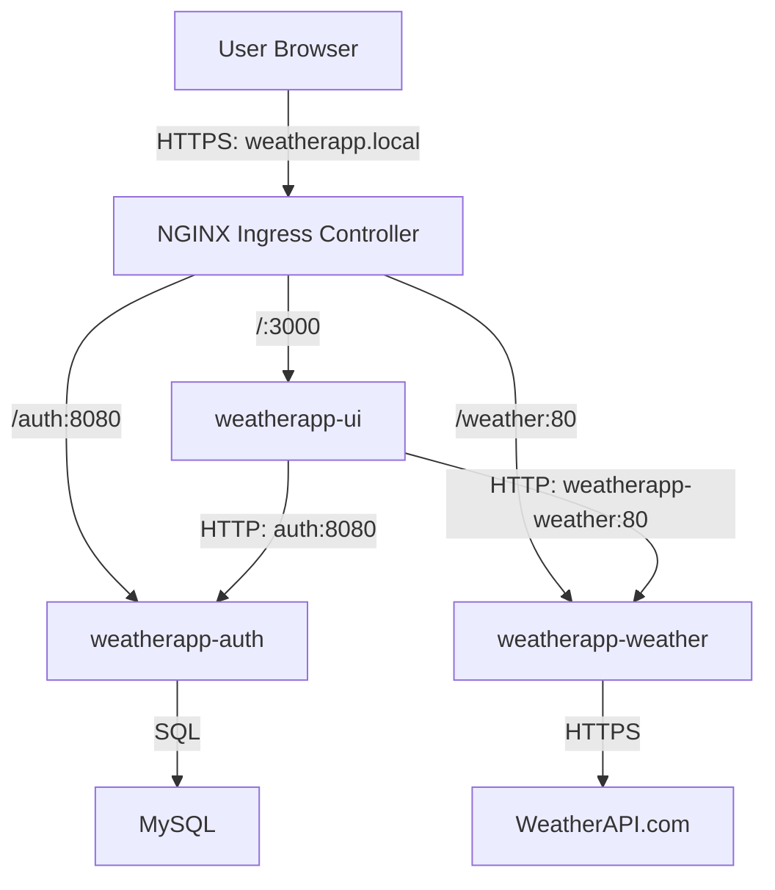

# WeatherApp-K8s


WeatherApp-K8s is a microservices-based web application designed for local deployment on Kubernetes using Docker Desktop. It enables users to register, log in securely, and access real-time weather data for cities worldwide through a modern web interface. This project showcases containerization, orchestration, and DevOps practices for building scalable applications in a local environment.

## Overview

WeatherApp-K8s provides a seamless experience for:
- Secure user authentication using JSON Web Tokens (JWT).
- Real-time weather data retrieval via an intuitive web interface.

Built with a **microservices architecture**, the application runs on a local **Kubernetes** cluster (via Docker Desktop). Each service is containerized using **Docker** and communicates through RESTful APIs.


## Architecture

The application consists of three core microservices, a database, and an ingress controller:



- **weatherapp-ui**: A Node.js/Express web interface for user interaction.
- **weatherapp-auth**: A Go/Gin service for user management and JWT-based authentication.
- **weatherapp-weather**: A Python/Flask service fetching weather data from WeatherAPI.com via RapidAPI.
- **MySQL**: Stores user credentials for the authentication service.
- **NGINX Ingress Controller**: Routes local traffic to the appropriate services.


## Kubernetes Resources Used

| Resource            | Purpose                                    |
| ------------------- | ------------------------------------------ |
| Deployment          | Manage pods, replicas, and rolling updates |
| Service (ClusterIP) | Enable stable inter-service communication  |
| Secret              | Store DB credentials & API keys securely   |
| Ingress             | Expose services externally with routing    |
| TLS Secret          | Enable HTTPS for secure connections        |


## Services

1. **weatherapp-auth** (Go/Gin)
   - Handles user registration and login.
   - Generates JWTs for secure session management.
   - Integrates with MySQL for user data storage.
2. **weatherapp-weather** (Python/Flask)
   - Fetches real-time weather data for specified cities.
   - Connects to WeatherAPI.com via RapidAPI.
3. **weatherapp-ui** (Node.js/Express)
   - Provides a responsive web interface for login, signup, and weather data display.
   - Communicates with auth and weather services via REST APIs.
4. **MySQL**
   - Stores user credentials in a local database.
5. **NGINX Ingress Controller**
   - Manages local traffic routing through `weatherapp.local`.

## Technologies

- **Languages**: Go, Python, JavaScript (Node.js)
- **Frameworks**: Gin, Flask, Express
- **Containerization**: Docker
- **Orchestration**: Kubernetes (Docker Desktop)
- **Database**: MySQL
- **External API**: WeatherAPI.com (via RapidAPI)
- **Ingress**: NGINX
- **Security**: JWT, TLS

## Prerequisites

- Docker Desktop with Kubernetes enabled
- kubectl for managing the Kubernetes cluster
- OpenSSL for generating TLS certificates
- A valid WeatherAPI.com API key (via RapidAPI)

## Setup Instructions

1. **Clone the Repository**
   ```bash
   git clone https://github.com/moostafasal/WeatherApp-K8s.git
   cd WeatherApp-K8s
   ```

2. **Install NGINX Ingress Controller**
   ```bash
   kubectl apply -f https://raw.githubusercontent.com/kubernetes/ingress-nginx/main/deploy/static/provider/cloud/deploy.yaml
   ```

3. **Create TLS Secret**
   ```bash
   openssl req -x509 -nodes -days 365 -newkey rsa:2048 -keyout tls.key -out tls.crt -subj "/CN=weatherapp.local"
   kubectl create secret tls weatherapp-ui-tls --cert=tls.crt --key=tls.key
   ```

4. **Configure Hosts File**
   Add the following to `/etc/hosts` (Linux/Mac) or `C:\Windows\System32\drivers\etc\hosts` (Windows):
   ```
   127.0.0.1 weatherapp.local
   ```

5. **Create Kubernetes Secrets**
   - For MySQL:
     ```bash
     echo -n "authpassword" | base64
     ```
     Update `kubernetes/mysql-secret.yaml` with the encoded value.
   - For WeatherAPI:
     ```bash
     echo -n "your-rapidapi-key" | base64
     ```
     Update `kubernetes/weather.yaml` with the encoded value.

6. **Deploy Kubernetes Resources**
   ```bash
   kubectl apply -f kubernetes/mysql-secret.yaml
   kubectl apply -f kubernetes/mysql-deployment.yaml
   kubectl apply -f kubernetes/mysql-service.yaml
   kubectl apply -f kubernetes/weather-secret.yaml
   kubectl apply -f kubernetes/weatherapp-auth-deployment.yaml
   kubectl apply -f kubernetes/auth-service.yaml
   kubectl apply -f kubernetes/weatherapp-weather-deployment.yaml
   kubectl apply -f kubernetes/weatherapp-weather-service.yaml
   kubectl apply -f kubernetes/weatherapp-ui-deployment.yaml
   kubectl apply -f kubernetes/weatherapp-ui-service.yaml
   kubectl apply -f kubernetes/weatherapp-ingress.yaml
   ```

7. **Verify Deployment**
   ```bash
   kubectl get pods
   kubectl get services
   kubectl get ingress
   ```

## Usage

1. Open `https://weatherapp.local` in your browser.
2. Register a new account or log in with existing credentials.
3. Enter a city name to view real-time weather data.
4. Check logs for debugging:
   ```bash
   kubectl logs -l app.kubernetes.io/name=weatherapp-ui
   ```

## Future Enhancements

- Implement bcrypt for secure password hashing.
- Use PersistentVolume for MySQL data persistence.
- Add Prometheus and Grafana for local monitoring.
- Integrate GitHub Actions for automated local testing.

